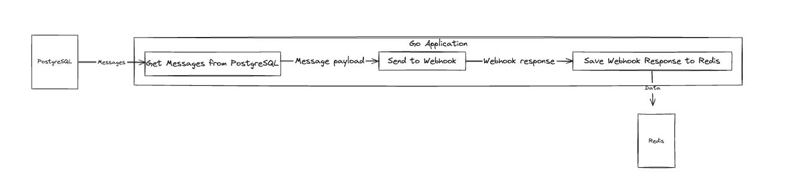

# Automatic Message Sending System

## Overview

This project implements an automatic message-sending system. The system retrieves unsent messages from a database and sends them automatically at regular intervals. It features API endpoints for starting/stopping automatic message sending and retrieving a list of sent messages.

## Summary



1. **Application**
    - Developed in Go language.
2. **Database**
    - Application using postgres as the database.
    - Stores message content, recipient phone numbers, and status information.
3. **Redis**
    - Redis cache stores message identifiers (messageId) and sending time.
4. **Rest API**
    - Endpoints for starting/stopping automatic message sending and retrieving sent messages.

## Installation

1. Clone the repository:

    ```bash
    git clone github.com/nlsra/message-system.git
    ```

2. Build and run with docker:

    ```bash
    docker compose build
    docker compose up message-system
    ```


## API Endpoints

- **Start/Stop  Message Sending:**
    - `POST /api/message/send`

- **Retrieve List of Sent Messages:**
    - `GET api/message`

## Usage

1. Start/Stop message sending:

    ```bash
    curl --location --request POST 'localhost:8000/api/message/send'
    ```
   
2. Retrieve list of sent messages:

    ```bash
    curl --location 'localhost:8000/api/message'
    ```


